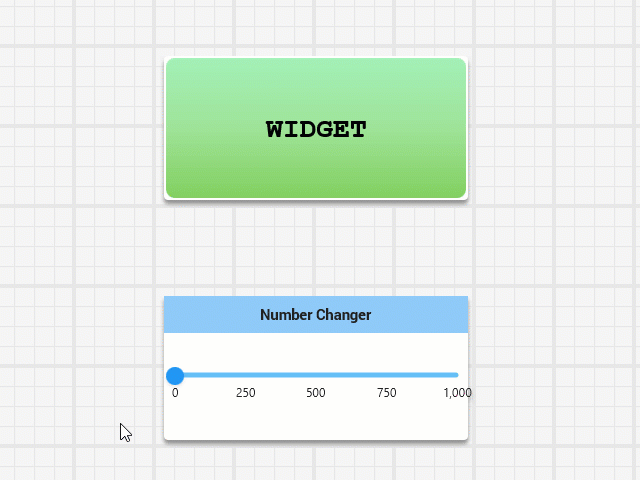
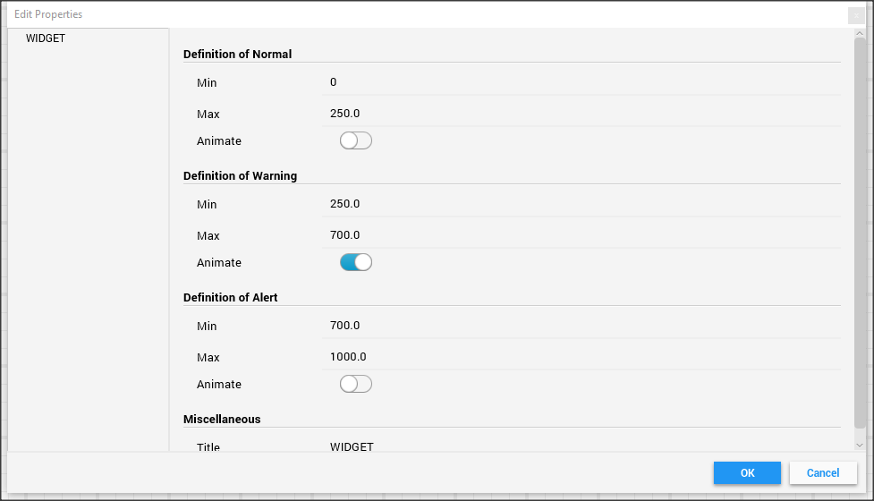

# FRC 2019 Shuffleboard Status Indicator Widget Library

A project dervied from my [FRC 2019 Shuffleboard widget tutorial](https://github.com/nleach999/Vortx3735.Shuffleboard.2019.WidgetTutorial) example code.  The widgets in this library were created with the tutorial project as a template.

## VorTx 3735 Text Status Indicator Widget

This widget displays 4 states in response to bound number ranges.

* Neutral - Represented by a blue background.  If there is no data bound or a data value that does not fit in
the range of one of the other states.

* Normal - Represented by a green background.  

* Warning - Represented by a yellow background.

* Alert - Represented by a red background.

As the state changes, the display "pulses" to help the user notice the state change.

Optionally, you may specify that any state causes the context to "wobble" each time data is received.  States that
are not set to animate do not wobble when data is received.

Setting it up is easy, just select the properties of the widget.  Set the min/max range values for each state and if you
want to enable the data reception wobble for the state.  The title of the widget is the display text.

